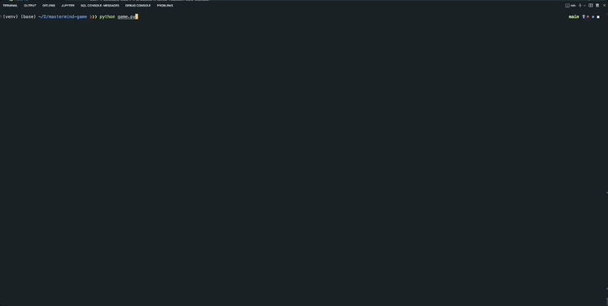

# Mastermind Game

This project is based on the popular deduction game, Mastermind, where players guess the color of hidden pegs. In this version, players take turns making a limited number of guesses and they use logic to deduce what numbers the computer has guessed.

## Demo



## Bash
Start a bash shell 

## Clone the repo
In the bash shell enter the command
```bash
git clone git@github.com:dtetreau251/mastermind-game.git
```
## Navigate to the directory with project
```bash
cd path_to_directory
```

## Virtual Environment
Create a virtual environment
```bash
  python -m venv venv
```
```bash
  source venv/bin/activate
```

## Installation

Clone the repo to your local machine and install python modules with pip
```bash
  pip install -r requirements.txt
```

## Running

cd into the main directory and run the game.py file:
```bash
  python game.py
```
    
## Lessons Learned

Creating my own computer game in Python was a great refresher in the Python programnming language. I used many core programming skills including variables, loops, conditional statements, functions, and other techniques and algorithms. Also, I had the satisfaction to play the game I created! I used tools and libraries which I had not previously been exposed such as cowsay and termcolor to add some styling to the terminal and make the experience more like a game. 

## 🚀 About Me
I'm an aspiring backend developer, and I love building things to help people do their jobs better. I have built several projects related to job searching while learning to code on my own!
## 🔗 Links
[](https://www.linkedin.com/)
